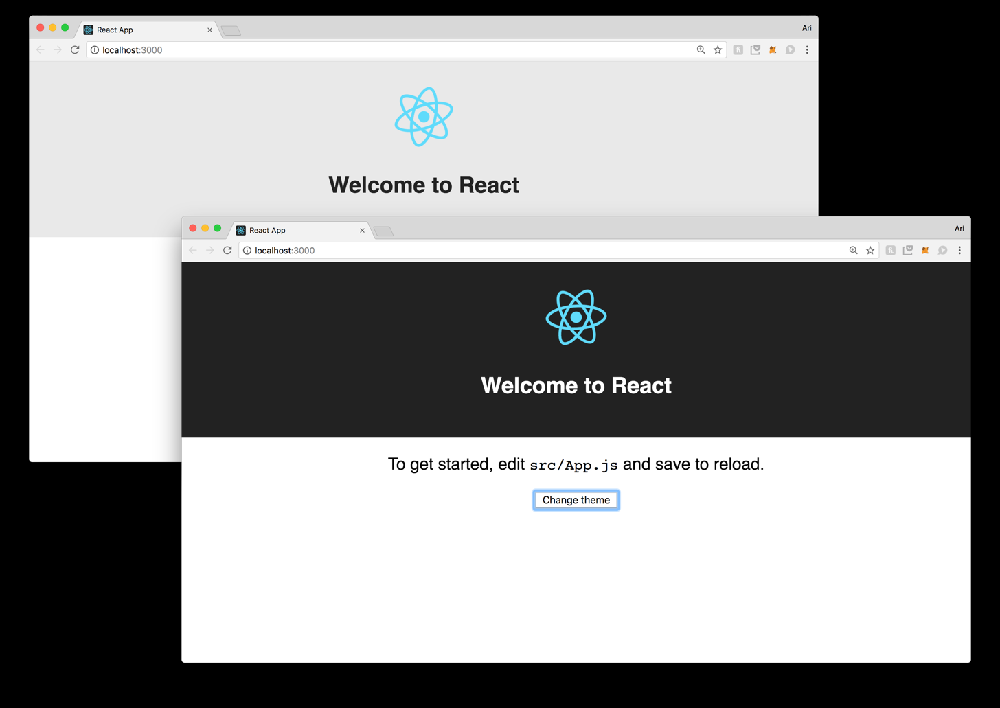

# Context

Chúng ta muốn truyền props từ root đến leaf mà không cần thông qua nhiều component trung gian

Từ React 16.3.0 ta có thêm cách mới này

Trong phiên bản thử nghiệm của `context` nó cho phép static type-checking và deep updates

Ví dụ là truyền theme xuống cho nhiều component

Chúng ta phải khai báo `Provider` component để truyền context. `Consumer` component là child của `Provider` component
đều có thể access context đó

VD ta muốn app cho người dùng chọn theme:


**B1:** tạo biến context bằng `React.createContext()`

```js
import React from 'react';
// ...
export const TenContext = React.createContext(/* default value */);
```

_`default value` có thể là: object, arr, string, number..._

```js
import React from 'react';
// ...
export const ThemeContext = React.createContext(themes.dark);
```

Ví dụ ở đây truyền `themes.dark` làm `default value`

**B2**: Provider `context`

Giờ ta sẽ dùng `Provide` component để pass down `ThemeContext` cho child component.

```js{8,17}
class App extends Component {
  state = { theme: themes.dark };

  // ...
  render() {
    return (
      <div className="App">
        <ThemeContext.Provider value={this.state.theme}>
          <Header/>
          <p className="App-intro">
            To get started, edit
            <code>src/App.js</code>
            and save to reload.
          </p>

          <button onClick={this.changeTheme}>Change theme</button>
        </ThemeContext.Provider>
      </div>
    );
  }

  // ...
}
```
`value` props của `ThemeContext.Provider` là giá trị truyền vào cho context, ta luôn phải truyền

`ThemeContext.Provider` là 1 component đặc biệt (`Provider` component), dùng để pass down data to child component


## Default value

## Multiple contexts